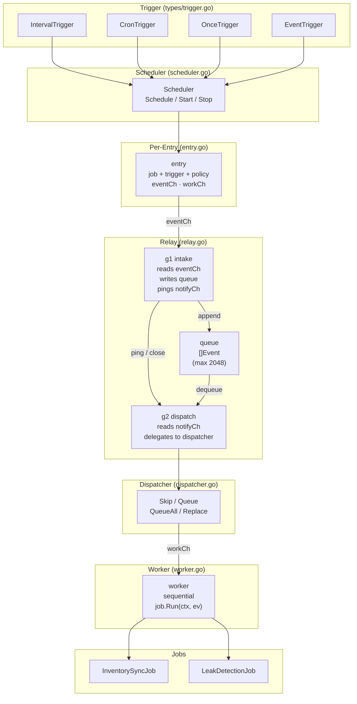
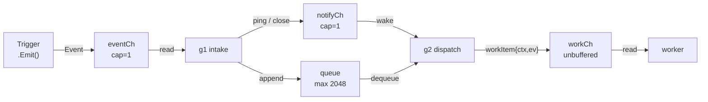
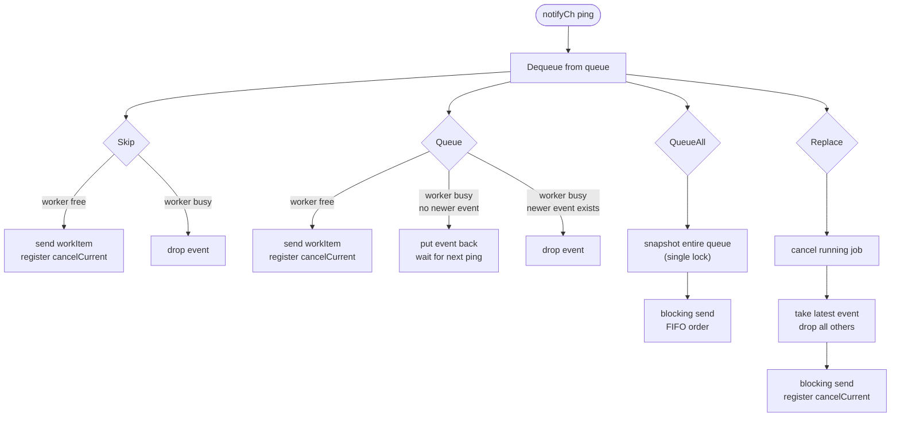
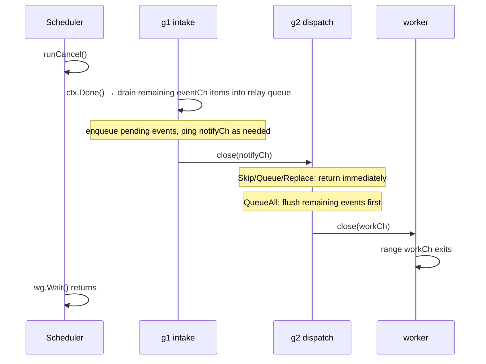
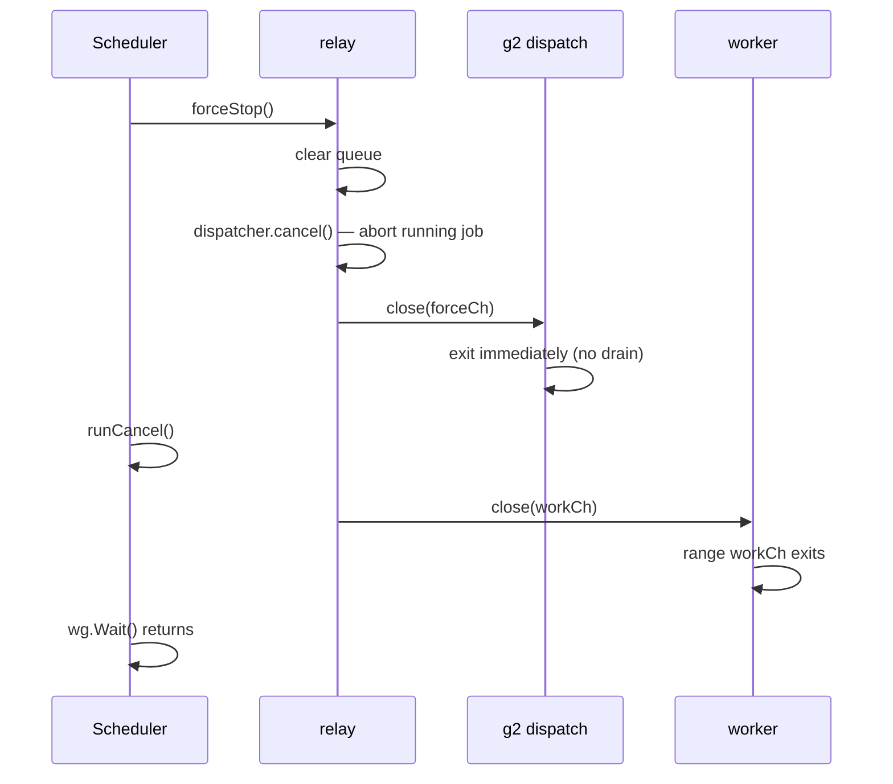

# Scheduler Architecture

Internal job scheduling framework for RLA. Handles time-based, startup, and
event-driven jobs with configurable overlap policies.

---

## Package Structure

```text
internal/scheduler/
  scheduler.go          — Scheduler: Schedule, Start, Stop
  entry.go              — entry (job+trigger+policy+channels), workItem
  relay.go              — relay: g1 (intake) + g2 (dispatch) pipeline
  dispatcher.go         — dispatcher interface + Skip/Queue/QueueAll/Replace
  worker.go             — worker: executes jobs sequentially from workCh
  types/
    job.go              — Job interface: Name(), Run(ctx, Event)
    event.go            — EventType, Event{Type, Payload}
    policy.go           — Policy: Skip, Queue, QueueAll, Replace
    trigger.go          — Trigger interface + IntervalTrigger, CronTrigger,
                          OnceTrigger, EventTrigger
  jobs/
    inventorysync/      — InventorySync job implementation
    leakdetection/      — LeakDetection job implementation
```

---

## Component Overview



---

## Per-Entry Pipeline

Each registered job runs in its own isolated pipeline of three goroutines:



**g1 — intake:** Reads `eventCh`, buffers into `queue` (drops oldest on
overflow), and non-blocking pings `notifyCh`. On exit, closes `notifyCh` to
signal g2 that no more events will ever arrive.

**g2 — dispatch:** Wakes on `notifyCh`, delegates dequeue and send logic to
the per-policy dispatcher. Exits on `notifyCh` close, `forceCh` close, or
`ctx.Done()`.

**worker:** Reads `workItem` values from `workCh` sequentially, calls
`job.Run(ctx, ev)`. Exits when `workCh` is closed by the relay.

---

## Dispatcher Behaviours



All dispatchers embed `dispatchBase` which holds `cancelCurrent`
(`context.CancelFunc`), allowing `forceStop` to abort the in-flight job
regardless of policy. `cancelCurrent` is registered only after a successful
send to `workCh`.

---

## Lifecycle

`Scheduler` is a **single-use object**. The expected call order is:

1. `Schedule(...)` — register jobs (one or more calls)
2. `Start(ctx)` — launch goroutines; returns an error if called more than once
3. `Stop(force)` — shut down and wait; returns an error if called more than once

Calling `Start` after `Stop` is rejected with an error. Reuse is not supported
because internal channels (`eventCh`, `workCh`, `notifyCh`) are closed during
shutdown and cannot be safely re-opened. Create a new `Scheduler` instance
instead.

---

## Shutdown Sequences

### Graceful — `Stop(force=false)`



### Force — `Stop(force=true)`



---

## Trigger Types

| Trigger | Fires | Exhausted when |
|---------|-------|----------------|
| `IntervalTrigger` | Every fixed duration | ctx cancelled |
| `CronTrigger` | On robfig/cron v1 6-field schedule | ctx cancelled |
| `OnceTrigger` | Exactly once, immediately | After first event sent |
| `EventTrigger` | On each event from an external `<-chan Event` | Source channel closed or ctx cancelled |

---

## Overlap Policy Summary

| Policy | Worker busy behaviour | Event ordering | Use when |
|--------|-----------------------|----------------|----------|
| `Skip` | Drop incoming event | N/A | Job is idempotent; only one concurrent run matters |
| `Queue` | Keep latest, discard rest | Latest only | Polling jobs: next run reads current state anyway |
| `QueueAll` | Buffer all, process FIFO | Strict FIFO | Each event carries unique data; best-effort — oldest events dropped on queue overflow, queue skipped on force-stop |
| `Replace` | Cancel current, run latest | Latest only | Only the most recent trigger is meaningful |

---

## Job Interface

```go
type Job interface {
    Name() string
    Run(ctx context.Context, ev Event) error
}
```

The `Event` is passed directly to `Run` — no context value extraction needed.
For time-based triggers (`IntervalTrigger`, `CronTrigger`, `OnceTrigger`),
`ev` is a zero-value `Event{}`. For `EventTrigger`, `ev` carries the
`Type` and `Payload` from the source channel.

---

## Key Design Decisions

- **Isolated pipeline per entry** — no shared state between jobs; one misbehaving
  trigger cannot block others.
- **g1/g2 split** — g1 owns the queue under a mutex; g2 reads from it. Separating
  intake from dispatch keeps the relay lock out of the blocking send to `workCh`.
- **notifyCh closure as termination signal** — g1 closing `notifyCh` is the
  natural "no more events" signal, eliminating a separate `intakeDone` channel.
- **forceCh for immediate exit** — a dedicated closed channel lets all dispatchers
  (including QueueAll's drain loop) exit without waiting for ctx cancellation.
- **cancelCurrent registered after send** — ensures `forceStop` always targets
  an actual running job, never a context that was never delivered.
- **Event passed directly to Run** — avoids hidden coupling through context values;
  the compiler enforces the contract.
